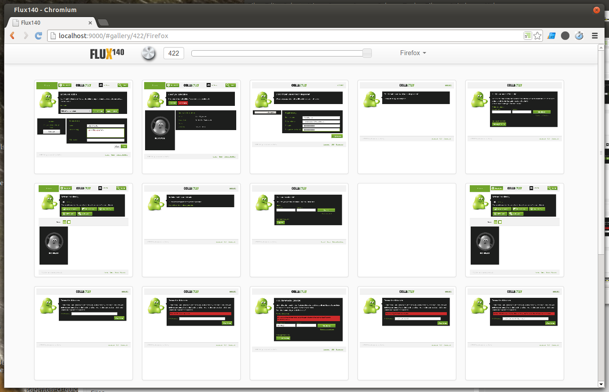
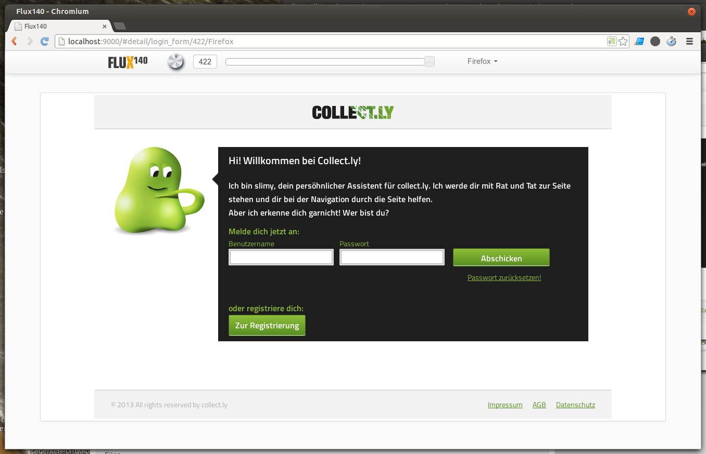

# Flux140

... is an offline web application that aims to expedite (and take the pain out of) visual regression testing. Flux140 is a picture viewer that simplifies comparing whole runs of a UI test suite by showing thumbnails of screenshots at a given point in time / build number. These screenshots have to be created in advance. We use our continuous integration server ([Jenkins](http://jenkins-ci.org/)) and [Selenium](http://docs.seleniumhq.org/projects/webdriver/) for that.

Created by [IT:Agenten](http://www.it-agenten.com "a Munich-based IT dev shop. We're awesome, check us out :)") and published under the permissive [MIT license](license.txt). We of course welcome all contributions, be it bug reports or code. If you don't have an CI stack running and have some money to spare, [IT:Agenten Gmbh](http://www.it-agenten.com/) is glad to help you out. Also, we are planning a ready-to-use SaaS offering.

### Screenshots

Everybody loves them.






### Shameless plug

Flux140 does not come with an easy install procedure unfortunately. If you are interested in an easy to use solution to record and analyse the progress of your web project and find regressions quickly, please __register for the private Beta of [Flux140 SaaS](http://www.flux140.de/)__.


### How to use

After checking out the repo, pull in dependencies using [Bower](http://bower.io/): In the ```flux140/frontend``` directory, issue the command ```bower install```.

Configure your CI stack (e.g. [Jenkins](http://www.jenkins-ci.org/), [Selenium](http://docs.seleniumhq.org/projects/webdriver/)) to copy the generated screenshots to a directory like this:

    content
    ├── tree.json
    └── Firefox
        ├── form_new_item
        │   ├── 116.png
        │   ├── 117.png
        │   ├── 118.png
        │   └── [...]
        └── form_new_item_submitted
            ├── 116.png
            ├── 117.png
            └── [...]

The screenshot files get their names from the current build number. When using Jenkins the build number is made available to your test scripts in the `BUILD_NUMBER` environment variable.

You (or rather your CI stack) will have to create `tree.json` using the free [tree tool](http://mama.indstate.edu/users/ice/tree/)  after adding new files:

    tree -J -v > tree.json

**NOTE**: The `-J` option for JSON output has not yet been merged into mainline tree, that is, tree v. 1.6.0 does not have it. Steve Baker, the tree author, will merge the changes in when he finds time. In the meantime, use [our version](https://github.com/itagenten/tree/tree/json).


### Shout-outs to our fellow open sorcerers

The application has been created using

* [Yeoman](http://yeoman.io/),
* [Bower](http://bower.io/),
* [Backbone.js](http://backbonejs.org/), 
* [Require.JS](http://requirejs.org/),
* [Tree](http://mama.indstate.edu/users/ice/tree/),
* [jQuery](http://jquery.com/),
* [jQuery UI slider plugin](http://jqueryui.com/slider/),
* [jQuery UI KnobKnob plugin](https://github.com/martinaglv/KnobKnob)

... using [Vim](http://www.vim.org/) on [Ubuntu](http://www.ubuntu.com/). Thanks to all of you folks! Long live open source!
